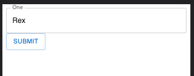
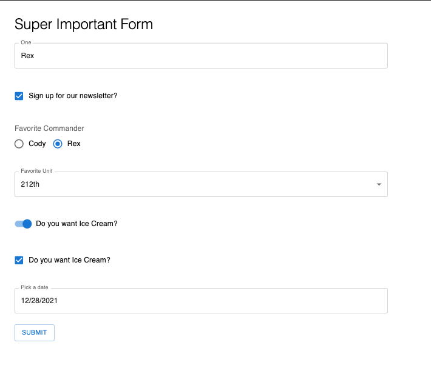
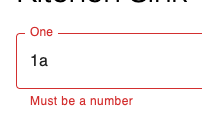

# Mantine Form Generator

An API for crafting Mantine powered forms.

[](https://www.npmjs.com/package/@caldwell619/mantine-form-generator) [](https://www.npmjs.com/package/@caldwell619/mantine-form-generator) []() []()

## Demo

[GH Pages](https://christopher-caldwell.github.io/mantine-form-generator/)

## Prerequisite

You'll need to fully setup Mantine, following [this](https://mantine.com/getting-started/installation/) guide.

This is based on Mantine v5, using **only** v4 will not work with this.

## Getting Started

```shell
yarn add @caldwell619/mantine-form-generator
```

## Quick Example

The following will render a single text input with a label of "One".

### Highlights

- The `name` property must match one of your object keys. This is the same behavior as [react-hook-form](https://react-hook-form.com/).
- Each type of input has their own `config`. The specifics are determined by the `type` property. For example, `select` requires you to pass `options`.

### Provider

**You must add a provider that wraps your form FOR EACH FORM YOU USE. **

This is not shown in this example, but is shown in [this one](./example/src/App.tsx), with just the single form.

### Code

```tsx
import { FC, useContext } from 'react'
import { MuiForm, Config, MantineFormContext } from '@caldwell619/mantine-form-generator'
import { Button } from '@mantine/material'
import { UseFormReturn } from 'react-hook-form'
import { diff } from 'deep-object-diff'

export const defaultValues: SomeObject = {
  one: 'Rex',
  two: 'Cody',
  three: 'Wolffe'
}

const inputs: Config<SomeObject>[] = [
  {
    type: 'text',
    config: {
      control: {
        name: 'one',
        label: 'One'
      }
    }
  }
]

export const Form: FC = () => {
  const { handleSubmit } = useContext<UseFormReturn<SomeObject>>(MantineFormContext)
  const onSubmit = (data: SomeObject) => {
    console.log('Current state of form', data)
  }
  return (
    <form>
      <MuiForm inputs={inputs} />
      <Button variant='outlined' onClick={handleSubmit(onSubmit)}>
        Submit
      </Button>
    </form>
  )
}

export interface SomeObject {
  one: string
  two: string
  three: string
}
```

### Result

The result is just a single input and your button under it. Clicking submit will console log an object showing your defaults:

```ts
{
  one: 'Rex',
  two: 'Cody',
  three: 'Wolffe'
}
```



## Detailed Example

There is a working example with a select input and a text field that can be found [here](./example/src/App.tsx)

## Supported Inputs

Currently, there are only 2 supported inputs, but this list will grow with time.

- Single Checkbox
- Custom Overrides
- Radio
- Select
- Switch
- Text
- Multi Checkbox ( Select all that apply )
- Checkbox Radio ( Many options, can only choose one )

## Custom Overrides

If an input you want is not supported, you can _"easily"_ pass your own custom input into the render. For an example, see the [Date override](./example/src/components/Date.tsx).

This is an example of using a Date picker, which is not supported natively by this tool, because they are so specific.
There are many different kinds, as well as requiring `@mantine/dates` as a peer dependency.

### Component

```tsx
import type { CustomOverrideRenderArgs } from '@caldwell619/mantine-form-generator'

export const DateFormInput = function <TData extends FieldValues>({
  field,
  fieldState: { error, invalid },
  dateInputProps
}: CustomOverrideRenderArgs<TData> & { dateInputProps?: DateInputProps }) {
  return <DateInput error={error?.message || invalid} {...field} {...dateInputProps} />
}
```

## Schema API

```tsx
{
  type: 'custom',
  config: {
    control: {
      name: 'startDate',
      children(props) {
        return <DateFormInput {...props} label='Start Date' />
      }
    }
  }
}
```

## All the inputs together from the example



## Validation

You may pass rules to each form component that act as validation. You can read more about the validation rules on [react hook form](https://react-hook-form.com/api/useform/register) under the "Register Options".

These rules are optional, and will be applied to the unit they are applied to. If none are given, it is assumed the input can be empty upon submission.

There is also validation in the example, [here](./example/src/forms/kitchen-sink/index.tsx).

```ts
rules: {
  required: { value: true, message: 'This is required' },
  pattern: { value: /^[0-9]*$/, message: 'Must be a number' }
},
```

When the error state is met, the message you provide will be shown as the helper text.

If there is not an error, and you do not provide `helperText`, it will be set to an empty string to prevent layout shift should an error occur. This means inputs might be sapced further apart because they essentially have an empty `helperText` to maintain the layout.



## Bundle Size

The bundle size is a bit deceptive, as the published version is unminified JS. I haven't found the best way to go about this, but it seems as if the best way is to just provide the source, and let you bundle it.

However you React will also tree shake and minify this library. I'm seeing an average of 3-5kb depending on which inputs are used. This will be less if you are already using these inputs elsewhere in the bundle.

## HoC to hook into the Form Provider

Sometime wrapping the consumer is tedious, you don't really need it at the next level, but it has to go somewhere.

```tsx
import { UseFormReturn } from 'react-hook-form'
import { MantineFormContext, MantineFormProvider } from '@caldwell619/mantine-form-generator'

const Form = () => {
  const { handleSubmit } = useContext<UseFormReturn<SomeObject>>(MantineFormContext)
  return (
    <MuiForm inputs={inputs} gridSpacing={1} />
  )
}

const WrappedForm: FC = () => {
  return (
    <MantineFormProvider>
      <Form>
    </MantineFormProvider>
  )
}
```

In the above, `WrappedForm` is unnecessary.

### Usage

Using `withMuiForm`, you can access the form config from the same component. It's similar to using `MantineFormContext.Consumer`, but a bit more conveinient.

```tsx
import { UseFormReturn } from 'react-hook-form'
import { withMuiForm, MantineFormContext, MuiForm } from '@caldwell619/mantine-form-generator'

export const Home = withMuiForm({ defaultValues }, () => {
  const { handleSubmit } = useContext<UseFormReturn<SomeObject>>(MantineFormContext)
  return <MuiForm inputs={inputs} gridSpacing={1} />
})
```
